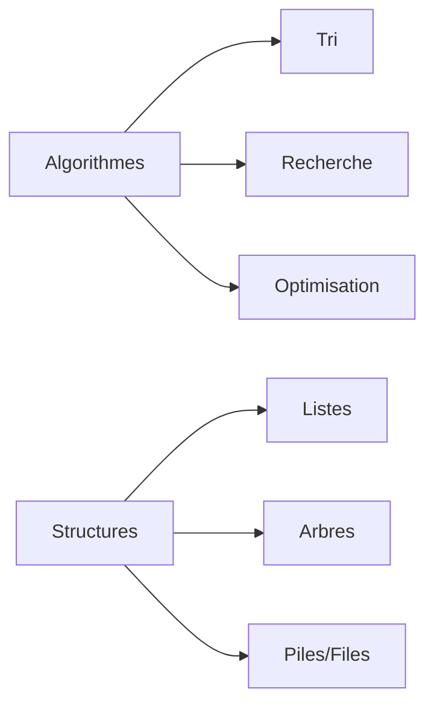

<h1 align="center">
    
</h1>

<h3 align="center"><u>Un développeur passionné</u></h3>

    

        🔄 En reconversion professionnelle 
        🎓 Étudiant à <strong>l'École 42</strong> 
        💡 Citation favorite: <em>"La meilleure façon d'obtenir la bonne réponse sur Internet n'est pas de poser une question, mais de poster la mauvaise réponse."</em> - Loi de Ward Cunningham
    

 
    
    

    

<h2 align="center"><u>🎯 Compétences Techniques (Hard Skills)</u></h2>

    

<h3 align="center"><u>💻 Programmation</u></h3>

<table>
    <tr>
        <td>
             
             Maîtrise approfondie des fondamentaux
        </td>
        <td>
            
             POO et concepts avancés
        </td>
        <td>
            
            
             Scripting et automatisation
        </td>
    </tr>
</table>

<h3 align="center"><u>🖥️ Systèmes et Réseaux</u></h3>

    
<strong>OS</strong>: Expertise UNIX/Linux

    
<strong>Process</strong>: Gestion avancée des processus et multithreading

    
<strong>Memory</strong>: Programmation bas niveau et gestion mémoire

    
<strong>Network</strong>: Architecture TCP/IP, protocoles réseau

    
<strong>Signals</strong>: Communication inter-processus UNIX

<h3 align="center"><u>🧮 Algorithmes et Structures de Données</u></h3>

Analyse de complexité (Big O)

Optimisation des performances

Implémentation de structures personnalisées

<h3 align="center"><u>🛠️ Développement de Logiciels</u></h3>

    
<strong>Bibliothèques</strong>: Création et maintenance (libft)

    
<strong>Systèmes</strong>: Shell UNIX, serveurs web

    
<strong>Games</strong>: Moteurs 2D/3D, ray-casting

    
<strong>Architecture</strong>: Design patterns et bonnes pratiques

<h3 align="center"><u>⚙️ Outils et Environnements</u></h3>

    
    
    
    
    

<h2 align="center"><u>🛠️ Technologies et Outils</u></h2>

    

<h2 align="center"><u>📚 Parcours 42 - Progression</u></h2>

<table align="center">
    <tr>
        <th>Niveau</th>
        <th>Projet</th>
        <th>Description</th>
        <th>Status</th>
    </tr>
    <tr>
        <td>00</td>
        <td><a href="https://github.com/Arcadiastyx/42-Piscine">Piscine</a></td>
        <td>Introduction intensive à la programmation</td>
        <td>✅</td>
    </tr>
    <tr>
        <td>01</td>
        <td><a href="https://github.com/Arcadiastyx/Libft">Libft</a></td>
        <td>Création de sa propre bibliothèque C</td>
        <td>✅</td>
    </tr>
    <tr>
        <td>02</td>
        <td><a href="https://github.com/Arcadiastyx/Printf">Printf</a></td>
        <td>Recréation de la fonction printf</td>
        <td>✅</td>
    </tr>
    <tr>
        <td>02</td>
        <td><a href="https://github.com/Arcadiastyx/Get_next_line">Get Next Line</a></td>
        <td>Lecture de fichier ligne par ligne</td>
        <td>✅</td>
    </tr>
    <tr>
        <td>03</td>
        <td><a href="https://github.com/Arcadiastyx/so_long-2d-game">So Long</a></td>
        <td>Création d'un jeu 2D simple</td>
        <td>✅</td>
    </tr>
    <tr>
        <td>03</td>
        <td><a href="https://github.com/Arcadiastyx/Mini-Talk">Minitalk</a></td>
        <td>Communication entre processus via signaux UNIX</td>
        <td>✅</td>
    </tr>
    <tr>
        <td>03</td>
        <td><a href="https://github.com/Arcadiastyx/Push_Swap">Push Swap</a></td>
        <td>Algorithme de tri avec deux piles</td>
        <td>✅</td>
    </tr>
    <tr>
        <td>04</td>
        <td>Cub3D</td>
        <td>Moteur de ray-casting style Doom</td>
        <td>🔄</td>
    </tr>
    <tr>
        <td>04</td>
        <td><a href="https://github.com/Arcadiastyx/Philosopher">Philosophers</a></td>
        <td>Problème des philosophes (threads)</td>
        <td>✅</td>
    </tr>
    <tr>
        <td>05</td>
        <td>Minishell</td>
        <td>Création d'un shell basique</td>
        <td>📝</td>
    </tr>
    <tr>
        <td>05-06</td>
        <td><a href="https://github.com/Arcadiastyx/CPP_module">CPP Modules</a></td>
        <td>Introduction à C++</td>
        <td>🔄</td>
    </tr>
</table>

<h3 align="center"><u>Légende</u></h3>

✅ Terminé

🔄 En cours

📝 À venir

<h2 align="center"><u>🌐 Solutions Web</u></h2>

<table align="center">
    <tr>
        <th>Catégorie</th>
        <th>Technologies</th>
        <th>Projets</th>
        <th>Description</th>
    </tr>
    <tr>
        <td rowspan="2">Frontend</td>
        <td>
            
            
        </td>
        <td><a href="#">Portfolio Personnel</a></td>
        <td>Site web personnel présentant mes projets et compétences</td>
    </tr>
    <tr>
        <td>
            
            
        </td>
        <td><a href="#">Applications Web</a></td>
        <td>Collection d'applications web interactives</td>
    </tr>
    <tr>
        <td>Backend</td>
        <td>
            
            
        </td>
        <td><a href="#">API REST</a></td>
        <td>Services web et APIs pour applications diverses</td>
    </tr>
    <tr>
        <td>Base de données</td>
        <td>
            
            
        </td>
        <td><a href="#">Gestion de Données</a></td>
        <td>Solutions de stockage et gestion de données</td>
    </tr>
    <tr>
        <td>DevOps</td>
        <td>
            
            
        </td>
        <td><a href="#">Infrastructure</a></td>
        <td>Configuration et déploiement d'applications</td>
    </tr>
</table>

<h3 align="center"><u>🚀 Projets en cours</u></h3>

    
Application web static + full stack

    
Site e-commerce avec panier dynamique

    
Dashboard administrateur avec analyses en temps réel

<h3 align="center"><u>📈 Objectifs d'apprentissage</u></h3>

    
TypeScript

    
Next.js

    
Tests unitaires et d'intégration

    
AWS Cloud Services

    
CI/CD avancé

